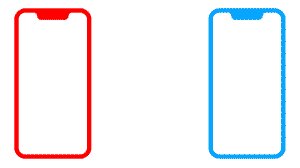

# Proximity

[](https://cocoapods.org/pods/Proximity)
[](https://cocoapods.org/pods/Proximity)
[](https://cocoapods.org/pods/Proximity)

Proximity is a bluetooth library for detecting when a BLE device is held up to the host device. 

It mimics the behavior of the AirPods connection/status sheet when holding open Airpods nearby an iPhone. It is also intended to be used in place of RFID.



## How it Works
Proximity continually monitors the signal strength of nearby BLE devices. This strength is referred to as the received signal strength indicator (RSSI). The RSSI is checked every time an advertising packet is received from nearby devices.

The `Proximity.delegate` is notified when the RSSI of a nearby device meets a threshold. The default threshold is -40. This value was selected based on testing with iPhone Xs, iPhone Xr, iPhone SE, and iPad Pro 3rd generation to get a notification when within a couple inches. It may be overridden via the `Proximity.immediateVicinityThreshold`.

## Example

To run the example project, clone the repo, and run `pod install` from the Example directory first.

## Usage

### Quick Start

```Swift
import Proximity

class MyViewController: UIViewController {

    let proximity = Proximity()

    override func viewDidLoad() {
        super.viewDidLoad()
        
        proximity.delegate = self
        proximity.startScanning(forPeripheralsWithServices: ["CAE2...03C3"])
    }

}

extension MyViewController: ProximityDelegate {

    func proximityDidUpdateState(_ proximity: Proximity) {}
    
    func proximityDidUpdatePeripherals(_ proximity: Proximity) {}
    
    func proximityThresholdPassed(by peripheral: Peripheral) {
        // peripheral is nearby
    }    

}

```

## Requirements


## Installation

Proximity is available through [CocoaPods](https://cocoapods.org). To install
it, simply add the following line to your Podfile:

```ruby
pod 'Proximity'
```

## Use Cases

### Tap-to-book a conference room
iPads outside conference rooms could each advertise a different service (UUID). An iPhone monitoring for all of those services could know which conference room iPad it tapped based on the detected service of the peripheral. Then the iPhone could book a meeting at the particular room.

## Goals

- [ ] The ability to connect and communicate with devices once detected.

## Author

Eric Kunz, ericjkunz@gmail.com, Fuzz Productions

## License

Proximity is available under the MIT license. See the LICENSE file for more info.

"proximity" icon by Andrejis Kirma from thenounproject.com.
"iPhone" icon by kakoki from thenounproject.com.